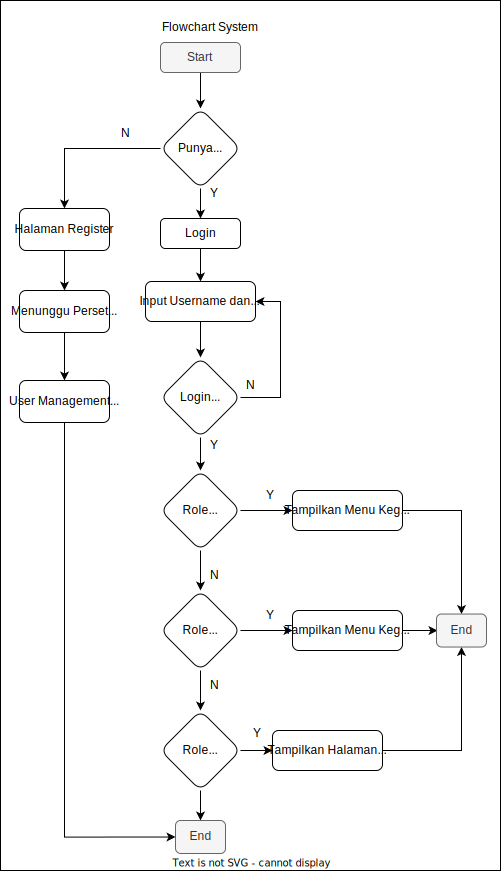
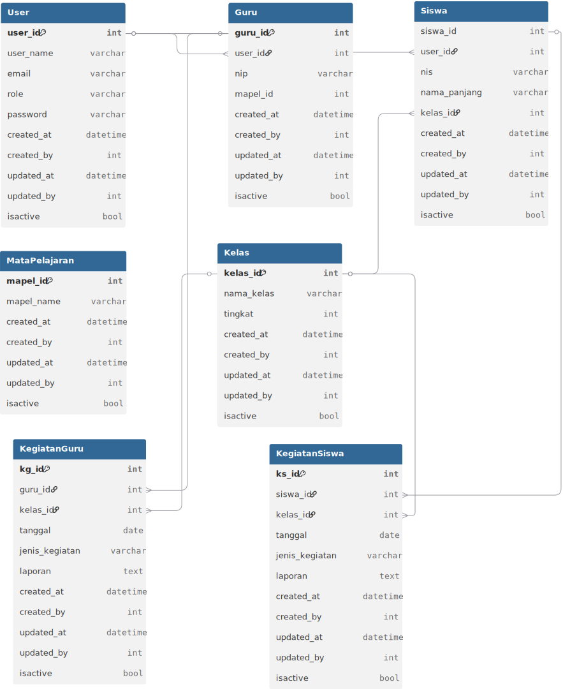

# 📚 Aplikasi Kegiatan Guru

Aplikasi kegiatan guru adalah perangkat lunak (piranti lunak) digital yang dirancang untuk membantu guru dalam mengelola berbagai kegiatan pembelajaran, administrasi, pengembangan diri, dan komunikasi di lingkungan sekolah. Aplikasi ini memanfaatkan teknologi informasi dan komunikasi untuk mendukung proses belajar mengajar, mulai dari merencanakan pelajaran, memantau perkembangan siswa, hingga melakukan evaluasi dan kolaborasi. 

---

## 🚀 Fitur Utama

- 🔐 **Login Aman**: Akses berbasis autentikasi pengguna.
- 🏠 **Dashboard Interaktif**: Tampilan ringkas kegiatan dan notifikasi penting.
- 📝 **Input Kegiatan Harian**: Catat kegiatan mengajar dan non-mengajar setiap hari.
- 📅 **Jadwal Mengajar**: Lihat dan kelola jadwal mengajar mingguan.
- 📤 **Unggah Laporan**: Unggah laporan kegiatan bulanan atau mingguan.
- 🚪 **Logout Aman**: Keluar dari sistem dengan sekali klik.

---

## 🧑‍💻 Teknologi yang Digunakan

- Frontend: `HTML`, `CSS`, `JavaScript` (opsional: `React` / `Vue`)
- Backend: `PHP Laravel` / `Node.js` / `Python (Flask/Django)`
- Database: `MySQL` / `MongoDB` / `SQLite`
- Diagram & Dokumentasi: `draw.io`, `dbdiagram.io`

---

## 🧭 Flowchart Sistem

Berikut adalah alur sistem aplikasi kegiatan guru:

---

## 🗂️ Database Diagram
Berikut adalah alur table database aplikasi kegiatan guru:

---

📫 Kontak
Untuk pertanyaan dan kolaborasi:

Nama: Muhamad Fauzan Raia Al-Fajri

Email: muhamadfauzanraia04@gmail.com

GitHub: github.com/RAIAFAUZAN
